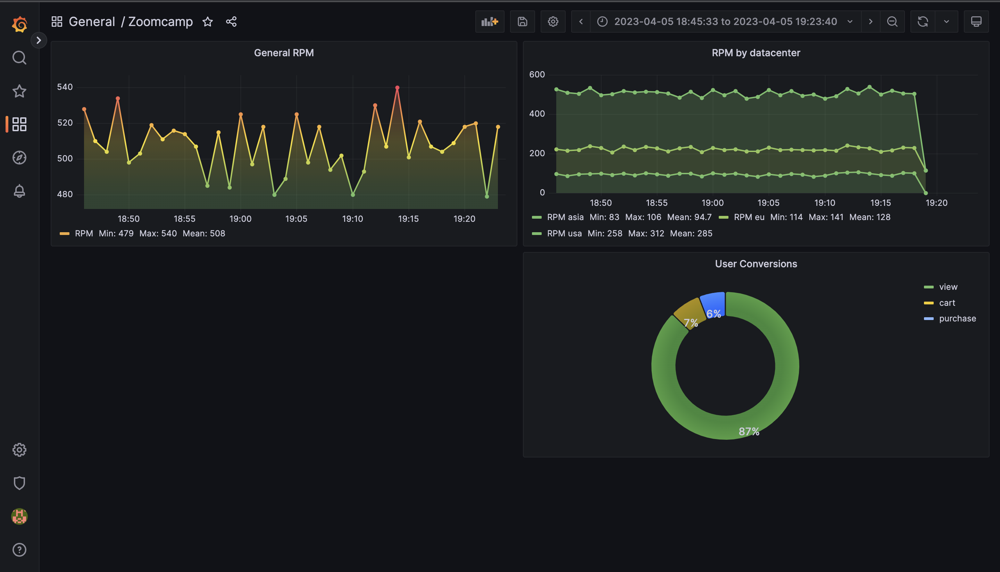

# DE-marketplace-analytics
## Introduction
Tasked with analyzing the stability metrics of a large online store that sells various goods across multiple locations in Europe, America, and Asia. The goal is to develop a development plan based on the most popular products and categories.

## Stability Metrics
The first issue that needs to be addressed is the stability of the online store's work across different locations. This includes assessing the store's uptime, availability, and response time from different locations. Factors such as network latency, bandwidth, and server load need to be taken into account to ensure that the store operates smoothly across all locations.

## Popular Products and Categories
Next, it's important to analyze the most popular products and categories sold by the store. This includes identifying the products that generate the most revenue, the most traffic, and the highest conversion rates. By understanding customer behavior and preferences, the store can make informed decisions about which products to promote, which products to discontinue, and which new products to introduce.

## Development Plan
Business analytics can use the information gathered from the stability metrics and popular products and categories analysis to develop a development plan that focuses on improving the store's stability and optimizing its product offerings. For example, they may recommend implementing a content delivery network (CDN) to improve the store's uptime and response time, or investing in marketing campaigns to promote the most popular products and categories.

Additionally, they may recommend introducing new products or expanding the store's offerings in certain categories to drive growth and revenue. The development plan should be based on data-driven insights and take into account the store's strengths and weaknesses.

## Conclusion
In conclusion, analyzing the stability metrics of work by location and the most popular products and categories is crucial for the success of a large online store. By leveraging this information, business analytics can develop a development plan that addresses the store's weaknesses and maximizes its strengths, ultimately driving growth and revenue.

# Data Pipeline
The pipeline starts with the Analytics System, which generates data from servers. This data is sent to Redis Temporary Storage, which is used to increase fault tolerance and smooth out load peaks. Since there is no criticality in the immediate appearance of data, the Microservice processes the data by performing primary validation and processing. If necessary, the Microservice uploads the data to the Data Warehouse, which in our case is Clickhouse.

From Clickhouse, the data is obtained for analysis and report generation for large sellers of our marketplace. The reports are generated and stored in the S3 Bucket for storage and easy access. Overall, this pipeline is designed to efficiently and effectively handle large volumes of data and ensure that it is processed and analyzed accurately to provide valuable insights for our business.

```
+-------------+    +-----------+    +----------------+    +-----------------+    +-------------------+
| Analytics   | -> | Redis     | -> | Microservice   | -> | Clickhouse      | -> | Report Generation |
| System      |    | Temporary |    | Data           |    | Data Warehouse  |    | and Storage       |
|             |    | Storage   |    | Validation     |    |                 |    | (S3 Bucket)       |
+-------------+    +-----------+    +----------------+    +-----------------+    +-------------------+
````

# Tools & Technology
- Cloud: Hetzner Cloud
- Infrastructure as code: Terraform
- Data Warehouse: Clickhouse, Redis
- Data Visualization: Grafana
- Containerization: Docker
- Orchestration: Docker Compose
- Programming Language: Python, SQL
- Data Transformation: Raw Python functions
  
ClickHouse is optimized for analytical queries, making it ideal for processing and analyzing large datasets in real-time. It supports a wide range of data formats, including CSV, JSON, and Avro, and provides a SQL-like query language for data retrieval and manipulation.

One of the key features of ClickHouse is its ability to compress data effectively, reducing storage requirements and improving query performance. It also supports a distributed architecture, allowing it to scale horizontally across multiple nodes to handle even larger data workloads.

Resume: The choice fell on it, since at the moment it is the best alternative to google big query with the possibility of self-hosted

Redis is commonly used as a temporary data store or cache in various applications, including web applications, real-time analytics, and message brokers. It is known for its fast performance and low latency, making it ideal for use cases that require fast access to data.

Grafana allows users to monitor and analyze large amounts of data in real-time, making it ideal for monitoring and analyzing system and application performance, as well as business metrics. It also provides a variety of features for collaboration and sharing, allowing users to share dashboards and data across teams and organizations.

# Data ingestion
In our data pipeline, we rely on multiple producers and a single consumer to efficiently manage the flow of information. To ensure smooth communication between these entities, we turn to Redis. Unlike Kafka, Redis provides us with the added security of protecting against memory overflow by constantly monitoring the data. This means we can rest easy knowing our system is operating at peak efficiency, even during times of high traffic and heavy data loads.

One of the benefits of working with Redis is its dynamic scalability. Depending on the load level and the readings of the graphs, we can easily adjust the number of consumers and producers to ensure maximum performance. And with Redis monitoring the occupancy status, we can make informed decisions about scaling up or down, optimizing our resources to the fullest.

But our data pipeline doesn't stop there. With stream processing in place, we can effectively and efficiently write all the data to our main ClickHouse warehouse. ClickHouse's powerful columnar database management system is optimized for analytical queries, allowing us to quickly and easily retrieve and manipulate large volumes of data.

Overall, our pipeline is designed to maximize efficiency and ensure that we can effectively manage and analyze data at scale.

# Data Visualization
Host: http://65.21.55.49:3000/

Login: visitor

Password: visitor

Dashboard: http://65.21.55.49:3000/d/sTLzqvYVk/zoomcamp


# Reproductivity

# Further Improvements:
